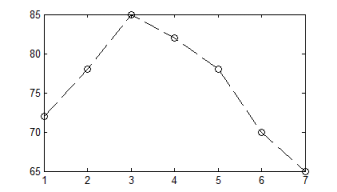

# Initiation à Matlab

Disponible en ligne depuis

[https://niess.github.io/matlab-instru/](https://niess.github.io/matlab-instru/)

## Session 2

_V. Niess_

_{{now}}_

---

# Objectifs de ce TD

* Les objectifs de cette seconde session de tutoriel sont de disposer des
  éléments nécessaires pour:

  * [_Représenter graphiquement_](#graphes) un ensemble de données.

  * Effectuer des [_traitements standards_](#traitement) de ces données:
    histogramme, transformée de Fourier, filtrage, ajustement et
    interpolation.

  Il n’est __pas__ question de traiter __complètement__ le contenu du document
  durant cette session, mais plutôt d’avoir un aperçu de ce qui peut être utile
  pour y revenir par la suite lors des TPs/projets.

* Comme précédemment les [réponses](#questions) aux questions sont disponibles
  à la fin.

---

# Scripts ... #1

_Ou comment Rome ne s’est pas faite en un jour ..._

* Au lieu de taper vos instructions dans la fenêtre de commande vous pouvez les
  écrire dans un fichier, appelé _script Matlab_. Par exemple, depuis le menu
  `File` de Matlab on peut créer un nouveau script, `new M-file`, contenant
  l'instruction suivante:
  ```matlab
  clear all
  ```
  On sauve ensuite le fichier sous le nom de `menage`. Notez que l’extension
  `.m` lui sera affecté.

  .warning[Le nom d'un script ne doit pas `comporter` d’espace, ni d’operateur
  tel que `+`, `-`, ni commencer par un chiffre, e.g. `total-menage` ou
  `4you`.]

---

# Scripts ... #2

* Un script peut être _exécuté_ en ligne de commande en tapant simplement son
  nom, selon:
  ```matlab
  >> menage
  ```
  .question[_Q1: Que fait ce script?_]

  De façon générale c’est une bonne idée de commencer votre script avec
  l'instruction précédente pour partir d’un environnement "propre".

* Vous pouvez insérer des _commentaires_ dans vos scripts avec le symbole `%`.
  Le texte qui suit le `%` sera ignoré par l’interpréteur.

  .question[_Q2: que renvoie: `(1+2) %==3`. Et : `(1+2)==3`. Pourquoi?_]

---

class: center, middle
name:graphes

# Représentation graphique

---

# Tracer un graphe

_To plot or not to plot?_

* La commande `plot` permet de tracer un graphe `(x, y)` ou `x` et `y` sont
  deux vecteurs de même longueur. La syntaxe est la suivante:
  ```matlab
  plot(x, y, format)
  ```
  L’argument `format` est une chaîne de caractères servant à spécifier
  la couleur, le marqueur et le type de trait du tracé. Par défaut
  `format = 'b-'` si il est omit, ce qui correspond à une ligne bleue pleine.
  Consultez l’aide de la fonction `plot` pour une liste détaillée des formats
  possibles.

* La commande plot permet également de tracer la valeur des éléments d’un
  vecteur, v, en fonction de l’indice. Il suffit d’omettre l’argument x, selon:
  ```matlab
  plot(v, format)
  ```

---

# Exemples de format de tracé

| Format                | Description                                      |
|:--------------------- |:------------------------------------------------ |
| 'k-', 'r-', 'b-'      | Ligne pleine noire, rouge ou bleue               |
| 'k.', 'r.', 'b.'      | Points noir, rouge ou bleu                       |
| 'k--', 'k:', 'k-.'    | Ligne noire en pointillé, interrompue ou mixte   |
| 'ko', 'ks', 'kd'      | Marqueur noir en forme de rond, carré ou losange |
| 'ko--', 'ks:', 'kd-.' | Superposition d’une ligne et d’un marqueur des   |
|                       | types ci-dessus.                                 |

.question[_Q3: quel format du tableau précedent a été utilisé pour réaliser
le graphe ci-dessous?_]
.center[]

---

# Exercice 1 : et pourtant il est rond!

* Tracez un _cercle de rayon unité_. On utilisera la définition paramétrique
  suivante:
  $$
  \begin{align}
  x &= \cos(\phi) \\\\
  y &= \sin(\phi)
  \end{align}
  $$

  où `\(\phi\)` est un vecteur de pas `\(\pi/6\)` rad. Pour le _format_ vous
  utiliserez une ligne pleine sur laquelle est superposée un marqueur du type
  et de la couleur de votre choix.
  > Que constatez-vous? Que se passe t’il si vous redimensionnez la figure
  > avec la souris?

* Tracez maintenant un cercle qui ait l’air d’un cercle à l’écran.
  > Pour régler l’une des 2 "anomalies" vous pouvez consulter l’aide de la
  > commande `axis`.

---

# Graphes superposés et figures multiples

* Si vous utilisez plusieurs fois la commande `plot` _par défaut le tracé
  précédent est écrasé_. Pour superposer plusieurs graphes sur une même
  figure il faut _activer la persistance_ de la figure avec la commande `hold
  on`. Pour désactiver de nouveau la persistance on utilisera simplement
  la commande `hold off`. Par exemple:
  ```matlab
  plot(x1, y1, 'k-')
  *hold on; % Les figures suivantes seront superposées.
  plot(x2, y2, 'r-')
  plot(x3, y3, 'b-')
  ```

* Pour réaliser un tracé dans une _nouvelle fenêtre graphique_ il faut utiliser
  la commande `figure`. Par exemple:
  ```matlab
  *figure; % 1ere figure.
  plot(x1, y1, 'k-')

  *figure; % 2eme figure.
  plot(x2, y2, 'r-')
  ```
---

# Figure active

* Lorsque vous créez une nouvelle figure celle-ci devient la _figure active_.
  C’est à dire que toute nouvelle commande graphique sera à destination de
  cette figure. La commande `gcf` pour `get current figure` renvoie le numéro
  de la figure active:

* Pour _changer de figure active_ on utilise la commande `figure` avec en
  argument le numéro de la figure que l’on souhaite rendre active. Par exemple:
  ```matlab
  figure(2)
  ```
  Notez que si la figure `2` n’existe pas elle sera _crée automatiquement_.
  Cette syntaxe vous permet donc également de créer une figure identifiée par
  le numéro de votre choix.

  .warning[Les figures sont persistantes dans l'environnement de Matlab. Pour
  détruire toutes les figures existantes l'on dispose de la commande
  `close all`.]

---

# Exercice 2 : les émoticônes anonymes

* Réalisez sur deux figures distinctes les émoticônes &#9786; et &#9785;.

  * Utilisez le cercle unité de l’exercice précédent comme _motif de base_.

  * Vous pouvez _translater et redimensionner_ le cercle unité avec des
    additions et multiplications.

  * Vous pouvez sélectionner un _arc de cercle_ en utilisant des indices
    logiques. Par exemple, si `(x,y)` sont les coordonnées des points du
    cercle unité, `(x(y>0), y(y>0))` est le demi cercle inférieur.

* Ecrivez vos commandes dans un script Matlab pour éviter d’avoir à tout
    retaper en cas d’erreur.
  > Notez que vous pouvez commenter certaines lignes de votre code plutôt
  > que de les effacer, si vous n’êtes pas sûrs de ne plus en avoir besoin.

---

# Limites des axes

* Par défaut, _Matlab sélectionne automatiquement les limites des axes_ `x` et
  `y` de façon à inclure l’ensemble des graphes tracés sur la figure. La
  commande `axis` permet de contrôler ce comportement ainsi que le rendu des
  axes. Consultez l’aide intégrée pour le détail des options. En particulier:

  * l'appel sans argument, selon:
    ```matlab
    lim = axis
    ```
    renvoie un tableau `1x4` contenant _les limites utilisées_ pour les axes x
    et y, i.e. `lim = [x_min, x_max, y_min, y_max]`.

  * l'appel avec un argument, selon:
    ```matlab
    axis(lim)
    ```
    permet de _redéfinir les limites_ des axes, ou `lim` est un tableau `1x4`
    défini comme précédemment.

---

# Echelle logarithmique

* Pour réaliser des tracés en échelle _logarithmique_ l'on dispose des commandes
  `loglog`, `semilogx` et `semilogy`. Les règles syntaxiques sont les mêmes que
  pour la commande `plot`, par exemple:

  ```matlab
  loglog(x, y, format)
  ```

  .warning[Si l’on essaie de superposer sur un même graphe des tracés en échelle
  log et linéaire, avec la commande `hold on`, le 1er tracé effectué
  détermine la représentation utilisée pour les axes.]

* Pour forcer l’utilisation d’une échelle après le tracé, e.g. avec `plot`, on
  peut faut modifier directement les propriétés de l’axe courant avec la
  commande `set`. Par exemple:

  ```matlab
  set(gca, 'xscale', 'log')

  set(gca, 'yscale', 'linear')
  ```

---

# Annoter un graphe ... #1

* Les fonctions `xlabel`, `ylabel`, et `title` permettent _d’annoter les axes_
  et d’écrire un titre sur la figure. Elles prennent une chaîne de caractères
  en argument. Par exemple :
  ```matlab
  title('cinétique de la réaction')
  xlabel('temps (s)')
  ylabel('concentration (mol)')
  ```
  > Les plupart des raccourcis LaTeX sont utilisables directement. Par exemple
  > '\mu' pour la lettre grecque &mu;.

* La commande `legend` permet _d’ajouter une légende_ aux figures contenant
  plusieurs tracés. Elle prend comme arguments des chaines de caractères
  contenant les légendes de chacun des tracés de la figures. Par exemple,
  pour une figure avec 2 courbes superposées :
  ```
  legend('avant', 'après')
  ```
  >  L’ordre des légendes est le même que celui utilisé pour le tracé des
  graphes.

---

# Annoter un graphe ... #2

* La commande `text` permet _d'ajouter manuellement du texte_ sur la figure. La
  syntaxe est:
  ```matlab
  text(x, y, message)
  ```
  ou `x` et `y` sont les coordonnées du texte dans la figure, selon le système
  d’axe utilisé, et `message` la chaîne de caractères à afficher.

* On peut _spécifier la couleur et la taille du texte_ avec les attributs:
  `color` et `fontsize`. La syntaxe est, par exemple:
  ```matlab
  text(x, y, message, 'color', 'r', 'fontsize', 18)
  ```
  les codes couleurs de la fonction `plot` étant utilisable. Pour les fonctions
  `xlabel`, `ylabel` et `title` la même syntaxe est utilisable.

* Pour _modifier les propriétés des axes_, ou de la légende il faut utiliser les
  commandes `gca` et `set` comme précédemment. Soit par exemple:
  ```matlab
  set(gca, 'fontsize', 14)
  ```

---

# Exercice 2b : nommer les émoticônes

* Rajoutez des titres aux figures et aux axes de vos émoticônes, ainsi qu’une
  légende. Sauvegardez ensuite le résultat.

  * Vous pouvez _sauvegarder et recharger_ votre figure via le menu `file` de la
    fenêtre de la figure.

  * Pour ouvrir ou sauvegarder une figure à partir de la ligne de commande
    vous disposez des commandes `open` et `saveas`

---

# Encore plus de graphes

* Il existe de nombreux autres types de graphes en Matlab. Vous pouvez en avoir
  un aperçu avec l’aide de `graph2d`, `graph3d` et `specgraph`. Voici une liste
  de quelques _types de graphes couramment utilisés_:

| Fonction   | Description                                    |
|:---------- |:---------------------------------------------- |
| `errorbar` | graphe 2D avec des barres d’erreur             |
| `bar`      | représentation d’un histogramme                |
| `contour`  | graphe 3D en courbes de niveaux                |
| `imagesc`  | représentation d’une matrice en image `bitmap` |
| `scatter`  | graphe avec des marqueurs de tailles variables |

* Enfin voici quelques _autres commandes graphiques utiles_:

| Fonction   | Description                            |
|:---------- |:-------------------------------------- |
| `close`    | Ferme une ou toutes les figures        |
| `subplot`  | Subdivise une figure en sous-figures   |
| `grid`     | Superpose une grille sur la figure     |
| `print`    | Exporte la figure dans un format image |

---

class: center, middle
name:traitement

# Traitement de données

---

# Propriétés standards d’une série de mesures

* Pour estimer quelques _propriétés standards d’une série de mesures_ on dispose
  des fonctions suivantes:

| Fonction         | Description                          |
|:---------------- |:------------------------------------ |
| `min`, `max`     | Plus petit/grand élément de la série |
| `mean`, `median` | Moyenne, médiane                     |
| `std`, `cov`     | Ecart type, covariance               |
| `sort`           | Ordonne la série                     |

  .question[_Q4: Que renvoient les codes suivants? Pourquoi?_
  ```matlab
  min([4, 5, 3])
  ```

  ```matlab
  sort([3, 5, 8, 1])
  ```]
---

# Histogrammes

* La fonction `hist` permet de calculer la distribution discrète, ou
  histogramme, d’une série de mesures, `x`, sur `[min(x); max(x)]` en divisant
  cet intervalle en `N` segments (_classes_) de même taille. La syntaxe est :
  ```matlab
  n = hist(x, N)
  ```
  La valeur retournée, `n`, est un vecteur de `N` élements contenant le nombre
  de valeurs de `x` comprises dans les `N` segments.
> La commande `hist` admet différentes syntaxes. Consultez l’aide pour plus de
> détails.

  .question[_Q5: que renvoie le code suivant? Pourquoi?_
  ```matlab
  n = hist([2, 3, 3, 2, 1, 3], 3)
  ```
  ]

* Pour _spécifier explicitement le centre des classes_ de l'histogramme vous
disposez de la fonction `histc`.

---

# Exercice 3 : fréquence des lettres

* Quelle sont les 3 lettres les plus utilisées dans le texte d’aide de la
  fonction `plot`, dans l’aide de `syntaxe`, et de façon générale en Anglais?

  * La forme fonctionnelle de `help` renvoie une chaîne de caractères contenant
    le texte de l’aide en ligne. Essayez par exemple:
    ```matlab
    texte = help(‘plot’)
    ```

  * Les lettres majuscules peuvent être converties en minuscules avec la
    fonction `lower`.
    > Rappel: les fonctions `double` et `char` permettent de convertir une
    > chaine de caractères en tableau de réels de codes ASCII et vice et
    > versa.

  * Utilisez la fonction `histc` ou `hist` pour dénombrer la fréquence
    d’occurrence des codes ACSII des différentes lettres. La fonction
    `sort` permet de trier le résultat.

---

# Intégration et différentiation ... #1

* Matlab manipule des _données discrètes_, e.g. une d.d.p. ou un pH qui ont été
  échantillonnés par un convertisseur analogique numérique. Cet échantillon de
  données est représenté dans Matlab par un vecteur de `N` éléments :
  `y = [y(t_1), ..., y(t_N)]` échantillonés aux temps `t = [t_1, ..., t_N]`.

* La dérivation et l’intégration sont approximées numeriquement par des
  opérateurs discrets. Voici une liste de quelques fonctions remarquables:

| Fonction   | Description                          |
|:---------- |:------------------------------------ |
| `diff`     | Différence terme à terme             |
| `gradient` | Gradient discret                     |
| `del2`     | Laplacien discret                    |
| `trapz`    | Integrale numérique par les trapèzes |
| `cumtrapz` | Primitive discrète par les trapèzes  |
| `conv`     | Convolution discrète                 |

  > Vous pouvez consulter l’aide de la section `datafun` pour le détail des
  > fonctions disponibles pour la manipulation de données échantillonnées.

---

# Intégration et différentiation ... #2

* Par exemple, l’approximation discrète de la dérivée de `y` par rapport à `t`
  peut être calculées selon :
  ```matlab
  dy = diff(y); % equivalent à y(2:end)-y(1:end-1)
  dt = diff(t);
  yp = dy/dt
  ```

  .question[_Q6: quelle est la taille des vecteurs_ `dy`, `dt` _et_ `yp` _?
  Quel autre fonction Matlab aurait-on pu utiliser pour que_ `y` _et_ `yp`
  _aient la même taille?_]

---

# Exercice 4: erreur numérique

* Pour x dans `[0;1]`, tracez sur un même graphe `y = exp(x)`, sa dérivée
  numérique et sa primitive numérique.

  > Vous pouvez utiliser la fonction `cumtrapz` pour calculer la primitive
  > numérique. Que constatez vous?

* Tracez l’erreur numérique relative sur la dérivée et la primitive. Interprétez
  le résultat. Comment cette erreur varie t’elle avec le pas d’échantillonnage
  en x?

  > Le gradient numérique d’un vecteur de données est calculé pour l’indice i
  > selon `(y(i+1)-y(i-1))/2`.

---

# Transformée de Fourier ... #1

* La _transformée de Fourier discrète_ est réalisée par la fonction `fft`, pour
  Fast Fourier Transform, du nom de l'algorithme sous-jacent. Ainsi, pour un pas
  d'échantillonage régulier `dt`:
  ```matlab
  Y = fft(y) * dt;
  ```
  est la transformée de Fourier discrète de `y` aux fréquences
  `f = Fs * [0:N-1]/N`, avec `Fs = 1/dt` la fréquence d'échantillonage.

  > Notez que les fréquences supérieures à `Fs/2`, la fréquence de Nyquist, sont
  > en fait repliées sur les fréquences négatives allant de `-Fs/2` à `0`. La
  > fonction `fftshift` permet de réordonner les composantes de Fourier de
  > `-Fs/2` à `Fs/2`.


* La transformée de Fourier renvoie à priori des _valeurs complexes_. Les
  fonctions `abs` et `angle` donnent le module et la phase d’un vecteur de
  nombres complexes.

---

# Transformée de Fourier ... #2

* La _transformée de Fourier inverse_ est réalisée par la fonction `ifft`.
  Consultez l’aide de `fft2` ou `fftn` pour réaliser _des transformées de
  dimension 2 ou plus_.

* Pour _l’analyse fréquentielle_ d’un signal stochastique ou étendue vous
  disposez des fonctions `psd` et `specgram`.

  * _La densité spectrale de bruit_, ou PSD en Anglais, caractérise la puissance
    d’un signal stochastique par bande de fréquence.

  * Le _spectrogramme_ d’un signal est quant à lui une représentation
    temps-fréquence de son contenu.

---

# Exercice 5: tchou-tchou! ... #1

* Analysez le signal sonore du fichier `train` de la bibliothèque audio de
  Matlab. Le signal est un enregistrement de sifflet d’un train.

  * Vous pouvez charger l’amplitude sonore `y` et la fréquence d’échantillonnage
    `Fs` avec la commande `load`, selon:
    ```matlab
    load('train');
    ```

  * Utilisez la fonction `fft` pour l’analyse fréquentielle.
  > Quelle est la résolution en fréquence? Combien(s) de fondamentales
  > distinguez vous? A quelles fréquence(s)?

  * Il est judicieux d’utiliser une échelle logarithmique pour représenter le
    spectre en intensité des composantes de Fourier.
    > Y a-t-il des harmoniques? De quel ordre?

---

# Exercice 5: tchou-tchou! ... #2

* Il est également intéressant de tracer le spectrogramme du signal pour
  avoir un aperçu général temps/fréquence.
  > Combien de coup(s) de sifflet observez vous?

---

# Filtrage ... #1

* Un _exemple simple de filtrage est la moyenne glissante_ sur deux échantillons
  successifs. Par exemple, pour un vecteur d’entré `e` on définie:
  ```matlab
  s = e(2:end) + e(1:end-1);
  ```
  Cette opération réalise un filtre passe bas d’ordre 1. De façon générale on
  peut définir un filtre numérique itérativement par une équation aux
  différences, selon:

  .center[`\( a_1 s_N = \sum_{k=1}^{N_B}{b_k e_{N+1-k}} -
  \sum_{k=2}^{N_A}{a_k s_{N+1-k}}\)`]

  ou `\(N\)` est la taille du vecteur d'entré, `e`. Le filtre est ainsi
  caractérisé par les vecteurs de coefficients `A` et `B` de tailles `\(N_A\)`
  et `\(Ǹ_B\)`.

  .question[_Q7: que valent_ `A` _et_ `B` _pour la moyenne glissante vue
  précédemment?_]

---

# Filtrage ... #2

* La fonction `filter` permet _d’appliquer un filtre numérique_ à un échantillon
  de données. La syntaxe est:
  ```matlab
  s = filter(B, A, e);
  ```
  Notez que cette commande ne permet __pas__ la _conception du filtre_, soit la
  détermination des coefficients `A` et `B`, mais uniquement son implémention.
  La `toolbox signal` fournit de nombreux outils pour la conception de filtres.
  Consultez l’aide en ligne si besoin.

* Si vous désirez vous _documenter d’avantage sur les filtres numériques_ et
  leur réalisation en Matlab, vous pouvez consulter le cours suivant, en
  Anglais:

  .center[http://www.cs.sfu.ca/~tamaras/filters/filters.html]

---

# Exercice 6: filtrage d’un bruit blanc ... #1

* On simule un échantillon de mesure, `y`, par un pic de signal Gaussien
  de durée `\(\sigma = 100\)` ms superposé à un bruit blanc, selon :
  ```matlab
  t = [-0.5:1E-03:0.5];         % Temps d'échantillonage.
  s = exp(-0.5 * t.^2 / 0.1^2); % Signal pic Gaussien
  b = 0.1 * randn(size(s));     % Bruit blanc Gaussien
  y = s + b;                    % Mesure simulée: signal + bruit.
  ```
  Le signal est échantillonné à une fréquence de 1 kHz entre `\(t = -0.5\)` s et
  `\(t = +0.5\)` s.

* A l’aide de la fonction `psd`, tracez la densité spectrale du signal et du
  bruit sur une même figure.
  > Quel type de filtrage pouvez vous utiliser pour extraire le signal du
  > bruit?

---

# Exercice 6: filtrage d’un bruit blanc ... #2

* Appliquez un filtre de votre choix pour améliorer le rapport signal sur
  bruit.
  > Que constatez vous?

  * Si vous disposez de la `toolbox signal` vous pouvez utiliser la fonction
    `butter` pour générer facilement un filtre d’ordre supérieur à 1.

  * Vous pouvez utiliser la fonction `sound` pour comparer à l’oreille le
    signal bruité et le signal filtré.

---

# Pseudo-inverse et ajustements linéaires #1

* La commande `inv` réalise l’inversion d’une matrice carrée permettant ainsi la
  résolution d’une système d’équations linéaires de n équations à n inconnues.
  Ainsi, pour résoudre `\(A X = B\)` il suffit de faire:
  ```matlab
  X = inv(A) * B;
  ```

* Dans le cas d’un système _surdéterminé_, comportant plus d’équations que
  d’inconnues il n’y a pas de solution exacte en général. On peut néanmoins
  définir une _pseudo-solution_ comme le vecteur `Xp` qui minimise la norme
  euclidienne de `\(|A X-B|\)`. On dit que `Xp` est le meilleur ajustement
  _au sens des moindres carrés_ au système d’équations. La pseudo solution est
  obtenue à partir du _pseudo inverse_ de `A`, en utilisant la fonction `pinv` :
  ```matlab
  Xp = pinv(A) * B;
  ```
  Le pseudo inverse est le résultat d’une _décomposition en valeurs singulières_
  de la matrice `A`, par la fonction `svd`. Cette décomposition est une
  généralisation de la diagonalisation à des matrices non carrées.

---

# Pseudo-inverse et ajustements linéaires #2

* Le calcul du pseudo inverse permet ainsi une résolution directe du problème
  d’ajustement linéaire non contraint, au sens des moindres carrés. C’est-à-dire
  la détermination des paramètres d’intérêt `\(x_i\)` d’une fonction
  d’ajustement, `\(f\)`, de la forme :
  $$ f(t) = \sum_i x_i f_i(t) $$

* Un cas particulier d’ajustement linéaire est _l’ajustement par un polynôme_,
  soit `\(f_i(t) = t^i\)`. Pour réaliser ce type d’ajustement on dispose de la
  fonction `polyfit`.

---

# Exercice 7: on a perdu les coefficients! #1

* C’est embêtant, on a perdu les coefficients ayant servi à calculer la moyenne
  pondérée des notes dans le transparent suivant. Tout ce dont on se souvient
  c’est que l’Anglais est coefficient `3`. Retrouvez les coefficients _nombres
  entiers_ des autres matières.

  * On se servira de la fonction `pinv` vue precedemment.

  * La fonction `round` permet d’arrondir un nombre à l’entier le plus proche.

---

# Exercice 7: on a perdu les coefficients! #2
$$\begin{array}{|l|ccccc|c|} \hline
\text{Elève}  & \text{Français} & \text{Anglais} & \text{Maths} &
  \text{Physique} & \text{Chimie} & \text{Moyenne} \\\\ \hline
\text{Nathan} & 11.0     & 9.0     & 10.5  & 8.0      & 6.0    & 8.5     \\\\
\text{Lucas}  & 12.5     & 7.0     & 11.5  & 10.5     & 10.0   & 10.5    \\\\
\text{Emma}   & 9.0      & 2.0     & 14.5  & 10.0     & 10.0   & 10.0    \\\\
\text{Enzo}   & 17.0     & 11.0    & 12.5  & 9.0      & 17.5   & 13.5    \\\\
\text{Léa}    & 9.0      & 12.0    & 11.5  & 13.0     & 12.5   & 12.0    \\\\
\text{Chloé}  & 12.5     & 17.0    & 1.0   & 9.5      & 3.5    & 7.5     \\\\
\text{Manon}  & 14.0     & 11.0    & 6.5   & 10.5     & 9.5    & 10.0    \\\\
\text{Louis}  & 12.0     & 15.5    & 11.0  & 8.5      & 8.0    & 10.5    \\\\
\text{Hugo}   & 9.0      & 9.5     & 14.0  & 9.5      & 17.5   & 12.5    \\\\
\text{Inès}   & 2.5      & 11.5    & 8.5   & 11.5     & 12.0   & 10.0    \\\\
\text{Jade}   & 11.0     & 12.0    & 10.0  & 8.0      & 8.5    & 9.5     \\\\
\text{Mathis} & 10.5     & 6.0     & 10.0  & 9.5      & 8.0    & 9.0     \\\\
\hline \end{array}$$

---

# Interpolation et Ré-échantillonnage ... #1

* Lorsque que l’on réalise un ajustement exact d’un échantillon de données,
  c’est à dire passant par tous les points de mesure, on parle
  _d’interpolation_. L’exemple le plus simple est _l’interpolation linéaire_ où
  les points de mesure sont connectés par des segments de droites.

  * L’interpolation linéaire est l’algorithme utilisé par Matlab lorsque vous
    réalisez un tracé avec un format de type `ligne`, e.g. 'k-', ou 'r--'.

  * Une interpolation d’ordre supérieur va connecter les points par des
    polynômes par morceaux en imposant en plus des condition de continuité des
    dérivées discrètes.

---

# Interpolation et Ré-échantillonnage ... #2

* La fonction `interp1` permet de réaliser une _interpolation à une dimension_,
  _par défaut linéaire_. Consultez l’aide en ligne pour la syntaxe.
  > Pour l’interpolation par des polynômes d’ordre 3 on dispose de la fonction
    dédiée `spline`, et éventuellement de la `toolbox splines`.

* Le rôle de l’interpolation est d’estimer les données en des points
  intermédiaires non échantillonnées. Dans le cas particulier où l’on réalise
  une interpolation des données avec un pas constant on effectue un _ré-
  échantillonnage_ numérique.
  > La `toolbox signal` met à disposition des fonctions dédiées pour cette
  > opération: `interp`, `resample` et `decimate`.

---

# Exercice 1b : interpolation du cercle

* On considère de nouveau un échantillonnage des coordonnées `\((x, y)\)` du
  cercle unité selon :
  ```matlab
  phi = [0 : pi / 6 : 2 * pi];
  x = cos(phi);
  y = sin(phi);
  ```

* Calculez l’interpolation linéaire de `x` et `y`, fonctions de phi, aux points
  `phip`, tel que :
  ```matlab
  phip = [0 : pi / 100 : 2 * pi];
  ```
* Recommencez avec des splines.

* Sur un même graphe, comparez les résultats des interpolations aux valeurs
  exactes en `phip` et à l’affichage réalisé par la fonction `plot` en utilisant
  un tracé de type trait plein: '-'.
  > Qu’en concluez-vous? Pourquoi Matlab fait-il ce choix d’interpolation pour
  > relier les points de mesure?

---

# Fonctions ... #1

* Matlab vous permet de _définir vos propres fonctions_, utilisables ensuite en
  ligne de commande ou au sein d’autres fonctions ou scripts. La procédure est
  la même que pour l’écriture d’un script à la seule différence que la
  1<sup>ère</sup> ligne de votre script doit être un __prototype__ définissant
  les variables d’entrée et de sortie de votre fonction. Par exemple, si votre
  fonction s’appelle `affectation2`, qu’elle prend deux arguments en entrée et
  renvoie deux arguments identiques en sortie, la syntaxe est :
  ```matlab
  *function [y1, y2] = affectation2(x1, x2)
  y1 = x1;
  y2 = x2;
  ```
  Il faut ensuite sauver le fichier `.m` dans votre répertoire de travail, de
  préférence en utilisant le même nom que celui de votre fonction, soit
  'affectation2.m' ici.

  .warning[Notez que votre fonction sera connue sous le nom utilisé pour sauver
  le fichier et non pas celui du prototype.]

---

# Fonctions ... #2

* Pour _appeler la fonction précédente_, la syntaxe est la même que pour le
  prototype, par exemple:
  ```matlab
  [y1, y2] = affectation2(x1, x2)
  ```
  ou 'affectation2' est le nom de votre fichier `.m`.

  > Notez que vous pouvez définir plusieurs fonctions au sein d’une même
  > fichier `.m`. Cependant, seule la 1<sup>ère</sup> fonction sera exécutable
  > en ligne de commande ou depuis d’autres fichiers. Néanmoins, les fonctions
  > d’un même fichier peuvent s’appeler mutuellement.

---

# Domaine d’existence des variables

* A la différence des scripts, les variables définies dans une fonction sont
  __locales__. C’est à dire qu’elles ne sont connues qu’au sein de la fonction
  et n’iront pas peupler l’espace de travail. Réciproquement, les variables de
  l’espace de travail ne sont pas connues au sein de la fonction.

  .question[_Q8: quel est le résultat de:_
  ```matlab
  [b, a] = affectation2(a, b)
  ```
  _Pourquoi?_]

* Le mot clef `global` vous permet de définir des variables dites __globales__,
  i.e. connues à la fois dans l’espace de travail et dans vos fonctions. De même
  le mot clef `persistent` définie des variables locales à une fonction, mais
  persistantes entre les appels. _Consultez l’aide en ligne pour plus
  d’information_.

---

# Exercice 8: récursivité et Fractales ... #1

* On s’intéresse au domaine de convergence de la série complexe définie par la
  relation de récurrence:

  $$ z_{n+1} = z_n^2 + c $$

  ou `c` est un nombre complexe quelconque. Représentez graphiquement les
  valeurs initiales `\(z_0\)` du plan complexe pour lesquelles la série est
  convergente. Le tracé obtenu est l’ensemble de Julia pour `c`.

* Pour initialiser les valeurs de `z` selon un échantillonnage régulier du
  plan complexe on pourra se servir de la fonction `meshgrid`. Par exemple :
  ```matlab
  x0 = [-1.5 : 5E-03 : 1.5];
  y0 = [-1.5 : 5E-03 : 1.5];
  [X0, Y0] = meshgrid(x0, y0);
  Z0 = X0 + j * Y0;
  ```
  réalise un échantillonnage de `[-1.5;1.5] x [-1.5;1.5]` par pas de `5E-03`.

---

# Exercice 8: récursivité et Fractales ... #2

* Définissez une fonction `julia` qui prend en argument le résultat `\(z_n\)`
  de l’itération précédente, renvoie `\(z_{n+1}\)` et représente
  graphiquement son module, selon `exp(-abs(z))`.
  > Pourquoi ne pas représenter `abs(z)` directement?

* Rappel: pour représenter graphiquement une matrice M vous pouvez utiliser
  la fonction `imagesc`.

  * La fonction `colormap` vous permet de changer la palette de couleur
    utilisée pour le graphique. Consultez l’aide de `hsv` pour une liste des
    palettes disponibles.

  * La fonction `colorbar` affiche la conversion entre les valeurs de `M` et
    le code couleur.

---

# Ajustement non linéaire et optimisation #1

* Lorsque la fonction d’ajustement dépend _non linéairement_ des paramètres
  d’intérêt il n’y a plus nécessairement unicité de la solution de moindre
  carré. On doit alors recourir à des _méthodes itératives_, par exemple de
  `descente de pente`, pour trouver le minimum du critère de mérite.

* Pour effectuer une minimisation, dans la version de base de Matlab, on dispose
  de deux fonctions: `fminbnd`, lorsqu’il n’y a qu’un seul paramètre et
  `fminsearch` sinon. La syntaxe est la suivante:
  ```matlab
  x = fminbnd('fonction', x1, x2);
  X = fminsearch('fonction', X0);
  ```
  où 'fonction' est le nom de la `fonction objectif` à minimiser. Dans les deux
  cas, _l’algorithme de minimisation demande une initialisation_ : un intervalle
  de recherche `[x1;x2]` dans le cas 1D, ou une hypothèse initiale `X0` dans le
  cas multidimensionnel.
  > Vous pouvez également passer des options de minimisation supplémentaires
  > sous la forme d’un objet structure, à la suite de l’initialisation.
  > Consultez l’aide de `optimset` si besoin.

---

# Ajustement non linéaire et optimisation #2

* La fonction objectif à minimiser doit accepter en entrée au moins un
  argument, le vecteur de paramètres d’intérêts `X` et renvoyer un scalaire.
  Si nécessaire, _des arguments supplémentaires_ peuvent être passés à la suite
  du vecteur de paramètres à optimiser. Il faudra également les transmettre à
  la routine d’optimisation. Soit par exemple, si le prototype de la fonction
  objectif est:
  ```matlab
  function obj = objectif(X, t, y)
  ```
  L’appel se fera selon:
  ```matlab
  X = fminsearch('objectif', X0, options, t, y);
  ```
  > Notez que vous pouvez passer un tableau vide, [], au lieu d’une structure
  > d’options. La fonction de minimisation utilisera alors des options par
  > défaut.

---

# Ajustement non linéaire et optimisation #3

* Il existe de _nombreux algorithmes d’optimisation_ dans la littérature
  scientifique. Les algorithmes de base de Matlab font une _minimisation
  locale_. Ils ne garantissent pas de trouver le _minimum absolu_. La pertinence
  de la solution obtenue dépend fortement du choix initial.
  > L’utilisation d’une `toolbox` tel que `optim` permet d’avoir accès à une
  > bibliothèque d’algorithmes d’optimisation multidimensionnels potentiellement
  > plus efficaces que la méthode des _simplex_, employée par `fminsearch`.

---

# Exercice 6b: ajustement Gaussien ... #1

* On revient sur la mesure simulée de l’exercice 6. On se propose cette fois-ci
  d’effectuer un ajustement de la mesure par un modèle Gaussien dépendant d’un
  vecteur `X` de 3 paramètres: l’amplitude, `X(1)`, la valeur centrale, `X(2)`,
  et l’écart type de la Gaussienne, `X(3)`, selon :
  ```matlab
  function y = modele(t, X)
  y = X(1) * exp(-0.5 * (t - X(2)).^2 / X(3)^2);
  ```

* On effectuera un ajustement des paramètres `X` du modèle selon un critère de
  moindre carré en définissant la `fonction objectif` suivante :
  ```matlab
  function cout = objectif(X, t, y)
  cout = mean((y - model(t, X)).^2);
  ```
---

# Exercice 6b: ajustement Gaussien ... #2

* Pour l’initialisation de l’ajustement on admet que seul le couple `(t, y)`
  des temps et valeurs échantillonnés est connu. On pourra par exemple utiliser
  `X0(1) = max(y)` comme valeur initiale de l’amplitude et traiter
  `p = y / trapz(y)` comme une densité de probabilité.
  > Comment estimer X0(2) et X0(3) à partir de p?

* Effectuez l’ajustement de `X` avec la fonction `fminsearch` puis tracez sur un
  même graphe la mesure simulée, le modèle pour les valeurs de paramètres `X0`,
  le modèle pour les valeurs de paramètres ajustées et pour le vrai signal.
  > Comment ce résultat se compare t’il avec le filtrage du bruit appliqué lors
  > de l’exercice 6? Qu’en concluez-vous?

---

class: center, middle
name:questions

# Réponses aux questions

---

# Réponses aux questions #1

* Q1: Scripts ... #2
  * Le script `menage` vide l’espace de travail de toutes les variables définies
    précédemment.

* Q2: Scripts ... #2
  * `(1 + 2) %== 3` renvoie le nombre 3 alors que `(1 + 2) == 3` renvoie le
    nombre logique `1`. En effet, dans le 1<sup>er</sup> cas le test d’égalité
    n’est pas interprété par Matlab, car tout ce qui suit le symbole `%` est un
    commentaire.

* Q3: Exemples de format de tracé
  * Le format utilisé est 'ko--', i.e. un marqueur `rond` avec une ligne
    pointillée.

---

# Réponses aux questions #2

* Q4: Propriétés standards d’une série de mesures
  * `min([4, 5, 3])` renvoie le plus petit nombre du tableau soit `3`.
  * `sort([3, 5, 8, 1])` renvoie le tableau ordonée du plus petit au plus grand
    élément, soit `[1, 3, 5, 8]`.

* Q5: Histogrammes
  * `n = hist([2, 3, 3, 2, 1, 3], 3)` renvoie le tableau `n = [1, 2, 3]`. En
    effet l'intervalle `[1;3]` est subdivisé en 3 classes : `[1;1+2/3[`,
    `[1+2/3; 2+1/3[` et `[2+1/3; 3[`. Les populations de ces classes sont
    respectivement `1`, `2` et `3`.

* Q6: Intégration et différentiation ... #2
  * Les vecteurs `dy`, `dt` et `yp` sont de taille `N-1`. Pour qu'ils aient la
    même taille que `y` l'on peut utiliser la fonction `gradient` au lieu de
    `diff`.

---

# Réponses aux questions #3

* Q7: Filtrage ... #1
  * Pour la moyenne glissante sur `n` points on a `A = 1` et
    `B = 1 / n * ones(1, n)`.

* Q8: Domaine d’existence des variables
  * `[b, a] = affectation2(a, b)` échange le contenu des variables `a` et `b`.
    En effet, les variables `a` et `b` passées en argument de la fonction sont
    locales à `affectation2`. Si l’on regarde la définition de la fonction on
    constate qu’à la 1<sup>ère</sup> variable retournée est affectée la valeur
    du 1<sup>er</sup> argument, et à la deuxième la valeur du second argument.
    Ainsi `b` prend la valeur initiale de `a` et `a` prend la valeur initiale
    de `b`.
